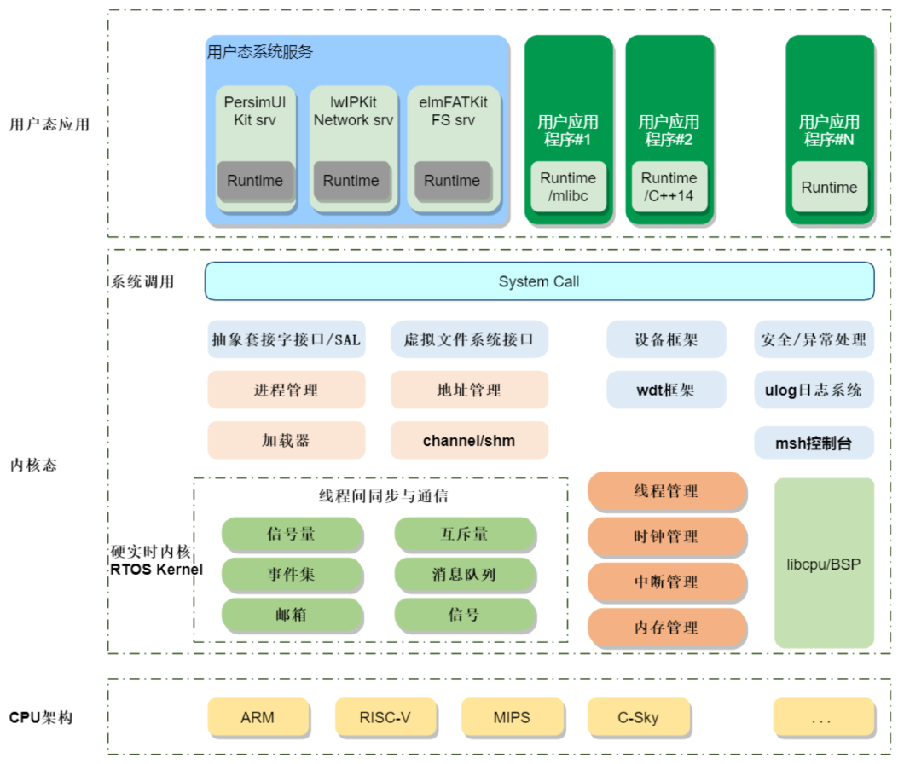

# RT-Thread

由于 RT-Thread 本身代码已经具有足够的复杂性,为了方便理解系统,这里对 RT-Thread 做简单介绍

RT-Thread(Real Time-Thread), 是一款广泛运用于嵌入式的实时多线程操作系统。RT-Thread 主要使用 C 语言编写，参考了面向对象设计的设计范式。同时，RT-Thread 采取的是微内核架构，具有一个极简的内核以及丰富的拓展、组件，同时支持在线软件包管理，提供更加丰富的功能和强大的裁剪能力以适应不同的设备。

我们这里使用的是 RT-Thread Smart 版本, 它是基于 RT-Thread 操作系统上的混合操作系统，它把应用从内核中独立出来，形成独立的用户态应用程序，并具备独立的地址空间.

RT-Thread 官方提供的架构图如下:

### 组件

作为一个微内核操作系统, RT-Thread 提供了许多组件(Components),我们对其中一些组件进行了改进、修复和优化。下面是主要的组件和他们对应的文档：

- [lwp](./components/lwp.md): 轻量级进程管理系统
- [dfs](./components/dfs.md): 设备虚拟文件系统
- [drivers](./components/drivers.md): 驱动组件
- [fal](./components/fal.md): Flash 设备组件
- [finsh](./components/finsh.md): Fin Shell
- [libc](./components/libc.md): c 标准库
- [mm](./components/mm.md): 用户程序内存管理组件
- [mprotect](./components/mprotect.md): 内存保护组件
- [net](./components/net.md): 网络支持组件
- [utilities.md](./components/utilities.md): 工具组件
- [legacy](./components/legacy.md): 向后兼容层

