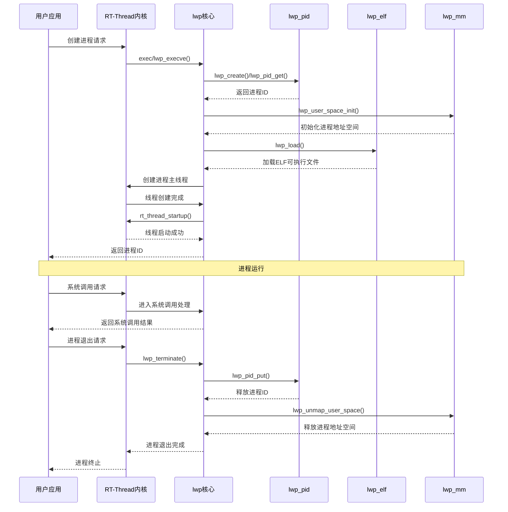

# lwp

lwp 是我们的轻量级进程管理系统, 它作为 RT-Thread 的一个核心组件,为 我们的系统提供了用户态的进程支持,同时提供进程间通信,资源隔离,系统调用等功能。



lwp 主要由下面几个部分组成：

### lwp 核心结构体

```c
// lwp.h
struct rt_lwp
{
#ifdef ARCH_MM_MMU
    size_t end_heap;
    size_t brk; // end of heap show to user
    rt_aspace_t aspace;
#else
#ifdef ARCH_MM_MPU
    struct rt_mpu_info mpu_info;
#endif /* ARCH_MM_MPU */
#endif /* ARCH_MM_MMU */

#ifdef RT_USING_SMP
    int bind_cpu;
#endif

    uint8_t lwp_type;
    uint8_t reserv[3];

    /* flags */
    unsigned int terminated:1;
    unsigned int background:1;
    unsigned int term_ctrlterm:1;  /* have control terminal? */
    unsigned int did_exec:1;       /* Whether exec has been performed */
    unsigned int jobctl_stopped:1; /* job control: current proc is stopped */
    unsigned int wait_reap_stp:1;  /* job control: has wait event for parent */
    unsigned int sig_protected:1;  /* signal: protected proc cannot be killed or stopped */

    struct rt_lwp *parent;          /* parent process */
    struct rt_lwp *first_child;     /* first child process */
    struct rt_lwp *sibling;         /* sibling(child) process */

    struct rt_wqueue waitpid_waiters;
    lwp_status_t lwp_status;

    void *text_entry;
    uint32_t text_size;
    void *data_entry;
    uint32_t data_size;

    rt_atomic_t ref;
    void *args;
    uint32_t args_length;
    pid_t pid;
    pid_t sid;                      /* session ID */
    pid_t pgid;                     /* process group ID */
    struct rt_processgroup *pgrp;
    rt_list_t pgrp_node;            /* process group node */
    rt_list_t t_grp;                /* thread group */
    rt_list_t timer;                /* POSIX timer object binding to a process */

    struct dfs_fdtable fdt;
    char cmd[RT_NAME_MAX];
    char *exe_file;                 /* process file path */

    /* POSIX signal */
    struct lwp_signal signal;

    // hewo added
    mode_t umask;

    struct lwp_avl_struct *object_root;
    struct rt_mutex object_mutex;
    struct rt_user_context user_ctx;

    struct rt_wqueue wait_queue; /* for console */
    struct tty_struct *tty; /* NULL if no tty */

    struct lwp_avl_struct *address_search_head; /* for addressed object fast search */
    char working_directory[DFS_PATH_MAX];

    int debug;
    rt_uint32_t bak_first_inst; /* backup of first instruction */

    struct rt_mutex lwp_lock;

    rt_slist_t signalfd_notify_head;

#ifdef LWP_ENABLE_ASID
    uint64_t generation;
    unsigned int asid;
#endif
    struct rusage rt_rusage;

#ifdef RT_USING_VDSO
    void *vdso_vbase;
#endif
};
```

### 系统调用

系统调用兼容 POSIX, 分为提供接口的 lwp_syscall.c 和 实现的 /lwp/syscall 目录下的文件.

### 其他重要模块

由进程管理模块较多,我们统一放在这里讨论

#### 内存管理

位于 /lwp/lwp_user_mm 和 /lwp/lwp_mm

提供了内存对应的接口,实现用户空间内存管理,内存锁等功能.

#### 进程ID管理

位于 /lwp/lwp_pid

负责 PID 的分配和管理,包括 PID 的分配,回收等功能.

#### 信号处理

位于 /lwp/lwp_signal

提供了信号处理的接口和实现,包括信号的发送,接收,处理等功能.

#### 进程间通信

位于 /lwp/lwp_ipc

提供了进程间通信的接口和实现,包括管道,消息队列,共享内存等功能.

#### 动态加载

位于 /lwp/lwp_elf

提供了 elf 格式的解析和加载功能,支持动态链接库,可以用来加载和执行用户程序.

#### AVL 树

位于 /lwp/lwp_avl

一个用于快速查找进程对象,管理进程资源的平衡二叉树


