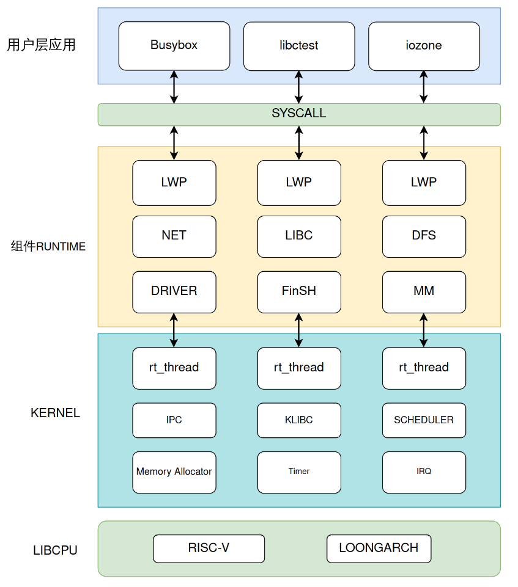
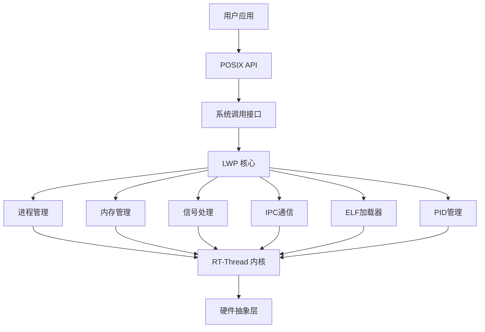
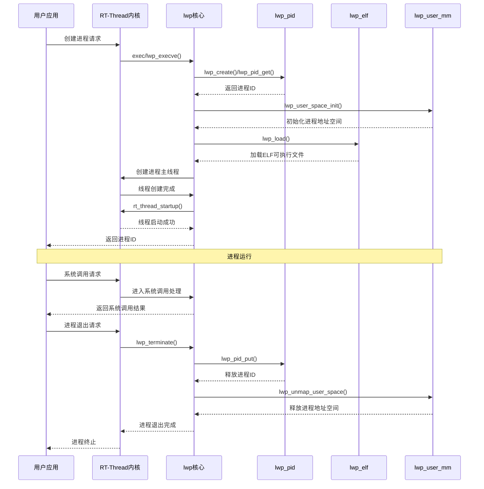
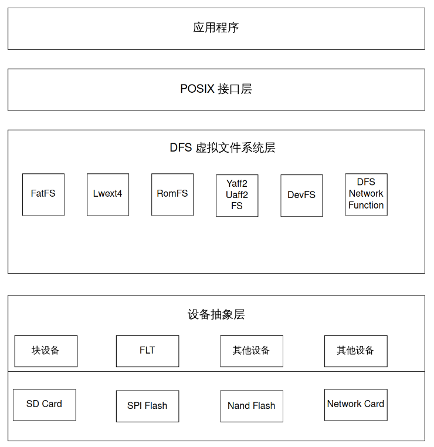

<div style="text-align: center; page-break-after: always;">
    <h1 style="font-size: 32pt; color: #2c5282; margin-top: 100pt;">KernelX 微内核实时操作系统</h1>
    <h2 style="font-size: 20pt; color: #4a90a4; margin-top: 30pt;">设计文档</h2>
    <div style="margin-top: 80pt; font-size: 14pt;">
        <p><strong>参赛队员：</strong></p>
        <p>张逸轩、刘镇睿、丁宏阳</p>
        <p><strong>学校：</strong></p>
        <p>杭州电子科技大学</p>
    </div>


# 高清的 KernelX 文档

## 目录

### [一、概述](#一概述)
- [1.1 简介](#11-简介)
- [1.2 架构](#12-架构)
- [1.3 设计理念](#13-设计理念)
- [1.4 项目结构](#14-项目结构)

### [二、快速启动](#二快速启动)
- [2.1 linux 环境](#21-linux-环境)
- [2.2 在评测机环境](#22-在评测机环境)
- [2.3 KernelX-环境](#23-kernelx-环境)

### [三、组件设计](#三组件设计)
- [3.1 进程管理](#31-进程管理)
  - [功能特性](#功能特性)
  - [架构设计](#架构设计)
  - [核心架构](#核心架构)
- [3.2 文件系统](#32-文件系统)
  - [功能](#功能)
  - [架构](#架构)
  - [核心结构](#核心结构)
  - [使用](#使用)
- [3.3 内存管理](#33-内存管理)
- [3.4 网络模块](#34-网络模块)
  - [LWIP](#lwip)
  - [AT](#at)
- [3.5 其余组件](#35-其余组件)
  - [FinSH](#finsh)
  - [Drivers](#drivers)
  - [FAL](#fal)
  - [LIBC 组件](#libc-组件)
  - [mprotect](#mprotect)
  - [Legacy](#legacy)
  - [utilities](#utilities)

### [四、问题与解决](#四问题与解决)
- [修复RT-Thread原有函数实现问题](#修复rt-thread原有函数实现问题)
- [修改系统调用逻辑和Linux一致](#修改系统调用逻辑和linux一致)
- [增加系统调用](#增加系统调用)

### [五、总结与展望](#五总结与展望)

### [六、开源引用声明](#六开源引用声明)

## 一、概述

### 1.1 简介

KernelX 是一个基于 RT-Thread Smart 的，使用 c 开发的微内核实时操作系统。

参赛队员为来自杭州电子科技大学的 张逸轩 刘镇睿 丁宏阳

由于 Gitlab 仓库大小限制，我们将带有提交记录的仓库上传至 GitHub: [KernelX](https://github.com/E1PsyCongroo/qemu-edu)

同时，我们给出了对应的 PPT 和 视频：[网盘链接](https://pan.baidu.com/s/1dlGYOMXAQnt5syfzeGS44w?pwd=xtqa)

### 1.2 架构



### 1.3 设计理念

RT-Thread(Real Time-Thread), 是一款广泛运用于嵌入式的实时多线程操作系统。RT-Thread 主要使用 C 语言编写，参考了面向对象设计的设计范式。同时，RT-Thread 采取的是微内核架构，具有一个极简的内核以及丰富的拓展、组件，同时支持在线软件包管理，提供更加丰富的功能和强大的裁剪能力以适应不同的设备。

我们选择以工业界广泛应用的 RT-Thread 作为基础进行拓展和创新，构建了 KernelX 微内核操作系统。我们基于以下理念：首先，我们希望立足于实际的生产，开发一款可以在实际应用场景中部署的操作系统，所以我们选择了在嵌入式领域被诸多使用的 RT-Thread。于此同时，RT-Thread 作为成熟的实时操作系统提供了坚实的微内核架构基础，使我们能够专注于系统功能的完善与优化。我们也希望借此机会深入理解微内核的设计理念和设计哲学。因此，我们选择 RT-Thread, 并且为他做了修复、优化、功能实现和设计兼容。


### 1.4 项目结构

```bash
.
├── compile_commands.json
├── Containerfile // Docker 生成配置
├── docs // 文档
│   ├── components // 组件文档目录
│   ├── img
│   ├── KernelX-环境.md
│   ├── KernelX-介绍.md
│   └── RT-Thread-介绍.md
├── gen_bear.sh // 用于 bear 生成 compile_commands 的脚本
├── LICENSE
├── machines // 板级支持
│   ├── qemu-loongarch
│   ├── qemu-virt-riscv64
├── Makefile // makefile, 用于测试
├── oscomp // 测试目录，用来生成供测试的文件
├── README.md
├── rt-thread // RT-Thread 目录，也是我们OS的主目录
│   ├── bsp //同样是板级支持
│   ├── ChangeLog.md
│   ├── components // 组件目录，下面包括多种组件
│   ├── examples
│   ├── include
│   ├── Kconfig
│   ├── libcpu // 提供不同架构的支持
│   ├── LICENSE
│   ├── README_de.md
│   ├── README_es.md
│   ├── README.md
│   ├── README_zh.md
│   ├── src // 源代码，也就是内核代码
│   └── tools
├── run.py // 我们的用于在普通 linux 环境下启动环境的脚本
├── testsuits-for-oskernel // 官方测试的克隆，同时修改了 Makefile 以提升编译效率
└── toolchains // 我们需要的工具链，一般是在 run.py 里面下载
    ├── install_ubuntu.sh
    ├── qemu-longarch
    └── qemu-virt-riscv6
```

## 二、快速启动

### 2.1 linux 环境

如果在非评测机下的linux环境，我们提供了 docker 环境。

我们提供了一个 python 脚本用来快速构建、启动镜像。

```bash
python3 run.py # 这一步会自动检索工具链并且安装，自动生成 docker 镜像并且启动，进入。

# 现在我们的目录是 /code

cd ./oscomp/rv
make all # 编译测试环境

cd /code/machines/qemu-virt-riscv64
pkgs --update
scons -c
scons -j12 # 编译系统

./run.sh ../../testsuits-for-oskernel/releases/sdcard-rv.img # 启动系统

```

### 2.2 在评测机环境

首先我们需要下载必要的工具，包括scons构建工具和一些python3必要的库

```bash
apt-get -y update
apt-get -y install scons python3-kconfiglib python3-tqdm python3-requests python3-yaml
```

然后下载gcc交叉编译工具链并安装opt目录下，同时设置环境变量

```bash
wget --no-check-certificate https://download.rt-thread.org/download/rt-smart/toolchains/riscv64gc-linux-musleabi_for_x86_64-pc-linux-gnu_latest.tar.bz2
tar jxvf /root/toolchains/qemu-virt-riscv64/riscv64gc-linux-musleabi_for_x86_64-pc-linux-gnu_latest.tar.bz2 -C /opt

bash ./toolchains/install_ubuntu.sh --gitee
source ~/.env/env.sh

export PATH=/opt/riscv64gc-linux-musleabi/bin:$PATH
```

到指定目录下构建

```bash
cd ./machines/qemu-virt-riscv64
pkgs --update
scons -j$(nproc)
```

同时，我们需要一个存放自己测试脚本的磁盘，在启动的时候OS会自动挂载

```bash
cd ./oscomp/rv
make all
```

磁盘位于./oscomp/rv/build/disk.img。

### 2.3 KernelX-环境

```bash

# 对于 riscv 环境：

echo $RTT_EXEC_PATH
/opt/riscv64gc-linux-musleabi_for_x86_64-pc-linux-gnu/bin

echo $RTT_CC_PREFIX
riscv64-unknown-linux-musl-

echo $PATH
/root/.local/bin:/root/.env/tools/scripts:/opt/riscv64gc-linux-musleabi_for_x86_64-pc-linux-gnu/bin:/opt/qemu-bin-9.2.1/bin:/opt/riscv64-linux-musl-cross/bin:/opt/loongarch64-linux-musl-cross/bin:/opt/gcc-13.2.0-loongarch64-linux-gnu/bin/:/opt/toolchain-loongarch64-linux-gnu-gcc8-host-x86_64-2022-07-18/bin/:/usr/local/sbin:/usr/local/bin:/usr/sbin:/usr/bin:/sbin:/bin:/opt/kendryte-toolchain/bin:/root/.cargo/bin:/opt/riscv64--musl--bleeding-edge-2020.08-1/bin

# 编译我们的系统
root@HewoArch:/# riscv64-unknown-linux-musl-gcc -v      
Using built-in specs.
COLLECT_GCC=riscv64-unknown-linux-musl-gcc
COLLECT_LTO_WRAPPER=/opt/riscv64gc-linux-musleabi_for_x86_64-pc-linux-gnu/bin/../libexec/gcc/riscv64-unknown-linux-musl/10.1.0/lto-wrapper
Target: riscv64-unknown-linux-musl
Configured with: /builds/alliance/risc-v-toolchain/riscv-gcc/configure --target=riscv64-unknown-linux-musl --prefix=/builds/alliance/risc-v-toolchain/install-native/ --with-sysroot=/builds/alliance/risc-v-toolchain/install-native//riscv64-unknown-linux-musl --with-system-zlib --enable-shared --enable-tls --enable-languages=c,c++ --disable-libmudflap --disable-libssp --disable-libquadmath --disable-libsanitizer --disable-nls --disable-bootstrap --src=/builds/alliance/risc-v-toolchain/riscv-gcc --disable-multilib --with-abi=lp64 --with-arch=rv64imafdc --with-tune=rocket 'CFLAGS_FOR_TARGET=-O2   -mcmodel=medany -march=rv64imafdc -mabi=lp64' 'CXXFLAGS_FOR_TARGET=-O2   -mcmodel=medany -march=rv64imafdc -mabi=lp64'
Thread model: posix
Supported LTO compression algorithms: zlib
gcc version 10.1.0 (GCC) 
build date: Oct 20 2023 16:21:07
build sha: 8a397096c1ef8f0e71f75edb27d7fc6996785206
build job: 547555
build pipeline: 203957

# 编译我们的测试环境 /oscomp
root@HewoArch:/# riscv64-linux-musl-gcc -v
Using built-in specs.
COLLECT_GCC=riscv64-linux-musl-gcc
COLLECT_LTO_WRAPPER=/opt/riscv64-linux-musl-cross/bin/../libexec/gcc/riscv64-linux-musl/11.2.1/lto-wrapper
Target: riscv64-linux-musl
Configured with: ../src_gcc/configure --enable-languages=c,c++,fortran CC='gcc -static --static' CXX='g++ -static --static' FC='gfortran -static --static' CFLAGS='-g0 -O2 -fno-align-functions -fno-align-jumps -fno-align-loops -fno-align-labels -Wno-error' CXXFLAGS='-g0 -O2 -fno-align-functions -fno-align-jumps -fno-align-loops -fno-align-labels -Wno-error' FFLAGS='-g0 -O2 -fno-align-functions -fno-align-jumps -fno-align-loops -fno-align-labels -Wno-error' LDFLAGS='-s -static --static' --enable-default-pie --enable-static-pie --disable-cet --disable-bootstrap --disable-assembly --disable-werror --target=riscv64-linux-musl --prefix= --libdir=/lib --disable-multilib --with-sysroot=/riscv64-linux-musl --enable-tls --disable-libmudflap --disable-libsanitizer --disable-gnu-indirect-function --disable-libmpx --enable-initfini-array --enable-libstdcxx-time=rt --enable-deterministic-archives --enable-libstdcxx-time --enable-libquadmath --enable-libquadmath-support --disable-decimal-float --with-build-sysroot=/tmp/m1132/build/local/riscv64-linux-musl/obj_sysroot AR_FOR_TARGET=/tmp/m1132/build/local/riscv64-linux-musl/obj_binutils/binutils/ar AS_FOR_TARGET=/tmp/m1132/build/local/riscv64-linux-musl/obj_binutils/gas/as-new LD_FOR_TARGET=/tmp/m1132/build/local/riscv64-linux-musl/obj_binutils/ld/ld-new NM_FOR_TARGET=/tmp/m1132/build/local/riscv64-linux-musl/obj_binutils/binutils/nm-new OBJCOPY_FOR_TARGET=/tmp/m1132/build/local/riscv64-linux-musl/obj_binutils/binutils/objcopy OBJDUMP_FOR_TARGET=/tmp/m1132/build/local/riscv64-linux-musl/obj_binutils/binutils/objdump RANLIB_FOR_TARGET=/tmp/m1132/build/local/riscv64-linux-musl/obj_binutils/binutils/ranlib READELF_FOR_TARGET=/tmp/m1132/build/local/riscv64-linux-musl/obj_binutils/binutils/readelf STRIP_FOR_TARGET=/tmp/m1132/build/local/riscv64-linux-musl/obj_binutils/binutils/strip-new --build=x86_64-pc-linux-muslx32 --host=x86_64-pc-linux-muslx32
Thread model: posix
Supported LTO compression algorithms: zlib
gcc version 11.2.1 20211120 (GCC) 
root@HewoArch:/# 

root@HewoArch:/# scons -v
SCons by Steven Knight et al.:
        SCons: v4.0.1.c289977f8b34786ab6c334311e232886da7e8df1, 2020-07-17 01:50:03, by bdbaddog on ProDog2020
        SCons path: ['/usr/lib/python3/dist-packages/SCons']
Copyright (c) 2001 - 2020 The SCons Foundation

```

为了方便使用,我们配置了一个 Containerfile, 用于生成跟评测机相同的环境.同时,我们实现了一个 run.py, 用于自动检测本机环境,补充对应工具链,生成对应 docker 镜像以及进入 docker 环境.

进入环境后, 我们主要工具链放置于 /opt, 代码放置于 /code, 采用卷挂载形式.

在 /code 目录下

```bash
cd machines/qemu-virt-riscv64 # 进入 riscv64 的目录
scons -c # 清理之前的构建
scons --menuconfig # 打开菜单,如果没有需求,可以直接退出
pkgs --update # 更新网络包
scons -j12 # 编译
./run.sh ../../testsuits-for-oskernel/releases/sdcard-rv.img # 这里允许指定打开什么镜像

```

## 三、组件设计

### 3.1 进程管理

lwp 是我们的 **轻量级进程管理系统** , 它作为一个核心组件,为 系统提供了用户态的进程支持,同时提供进程间通信,资源隔离,系统调用等功能。

#### 功能特性

- **进程管理**：创建、销毁、调度用户态进程
- **内存隔离**：每个进程拥有独立的虚拟地址空间
- **系统调用**：POSIX 兼容的系统调用接口
- **进程间通信**：管道、消息队列、共享内存、信号等
- **动态加载**：支持 ELF 格式的可执行文件和动态链接库
- **作业控制**：进程组、会话管理、终端控制
- **信号处理**：完整的 POSIX 信号机制
- **资源管理**：文件描述符、定时器、内存等资源的生命周期管理

#### 架构设计

##### 整体架构



##### 进程流程



#### 核心架构

##### lwp 核心结构体

```c
// lwp.h
struct rt_lwp
{
#ifdef ARCH_MM_MMU
    size_t end_heap;
    size_t brk; // end of heap show to user
    rt_aspace_t aspace;
#else
#ifdef ARCH_MM_MPU
    struct rt_mpu_info mpu_info;
#endif /* ARCH_MM_MPU */
#endif /* ARCH_MM_MMU */

#ifdef RT_USING_SMP
    int bind_cpu;
#endif

    uint8_t lwp_type;
    uint8_t reserv[3];

    /* flags */
    unsigned int terminated:1;
    unsigned int background:1;
    unsigned int term_ctrlterm:1;  /* have control terminal? */
    unsigned int did_exec:1;       /* Whether exec has been performed */
    unsigned int jobctl_stopped:1; /* job control: current proc is stopped */
    unsigned int wait_reap_stp:1;  /* job control: has wait event for parent */
    unsigned int sig_protected:1;  /* signal: protected proc cannot be killed or stopped */

    struct rt_lwp *parent;          /* parent process */
    struct rt_lwp *first_child;     /* first child process */
    struct rt_lwp *sibling;         /* sibling(child) process */

    struct rt_wqueue waitpid_waiters;
    lwp_status_t lwp_status;

    void *text_entry;
    uint32_t text_size;
    void *data_entry;
    uint32_t data_size;

    rt_atomic_t ref;
    void *args;
    uint32_t args_length;
    pid_t pid;
    pid_t sid;                      /* session ID */
    pid_t pgid;                     /* process group ID */
    struct rt_processgroup *pgrp;
    rt_list_t pgrp_node;            /* process group node */
    rt_list_t t_grp;                /* thread group */
    rt_list_t timer;                /* POSIX timer object binding to a process */

    struct dfs_fdtable fdt;
    char cmd[RT_NAME_MAX];
    char *exe_file;                 /* process file path */

    /* POSIX signal */
    struct lwp_signal signal;

    mode_t umask;

    struct lwp_avl_struct *object_root;
    struct rt_mutex object_mutex;
    struct rt_user_context user_ctx;

    struct rt_wqueue wait_queue; /* for console */
    struct tty_struct *tty; /* NULL if no tty */

    struct lwp_avl_struct *address_search_head; /* for addressed object fast search */
    char working_directory[DFS_PATH_MAX];

    int debug;
    rt_uint32_t bak_first_inst; /* backup of first instruction */

    struct rt_mutex lwp_lock;

    rt_slist_t signalfd_notify_head;

#ifdef LWP_ENABLE_ASID
    uint64_t generation;
    unsigned int asid;
#endif
    struct rusage rt_rusage;

#ifdef RT_USING_VDSO
    void *vdso_vbase;
#endif
};
```

##### 系统调用

系统调用(syscall) 模块提供用户空间与内核空间的接口，兼容 POSIX 标准，用来提供多种操作的上层api,并且具有完善的权限检查和安全控制。

##### 内存管理

内存管理模块 是 **mm** 组件的用户空间内存管理上层封装和拓展，负责用户进程的虚拟内存管理，内存隔离和保护。提供了内存映射，页面权限管理，堆栈管理，内存锁等内存操作

##### 进程ID管理

PID 管理模块 负责 PID 的分配和管理,包括 PID 的分配,回收，查找等功能。

##### 信号处理

信号系统提供了异步事件通知机制，兼容 POSIX 型号标准，负责信号处理的接口和实现,包括信号的发送,接收,处理，信号队列管理，实时信号支持等功能.

##### 进程间通信

IPC 模块提供多种进程间通信机制，支持数据交换和同步,包括管道,消息队列，套接字通信,共享内存等功能.

##### 动态加载

提供了 elf 格式的解析和加载功能,支持动态链接库,可以用来加载和执行用户程序.

##### 作业控制

作业控制系统提供了进程组和绘画管理功能，支持前后台进程控制

### 3.2 文件系统

DFS (Device File System) 是我们的 **设备虚拟文件系统**，提供了 v1 和 v2 两个版本，这里使用 v2 版本。

#### 功能

- 提供了统一的，POSIX 兼容的接口，如 open, read 等。
- 支持多种不同的文件系统, 提供普通文件、设备文件和网络文件描述符的管理功能。
- 支持多种类型的存储设备。

#### 架构



##### POSIX 接口层

POSIX 实现了标准的 POSIX 文件操作接口，如 open(), read(), write(), close() 等，为应用程序提供了符合 POSIX 标准的文件系统访问接口。，目的是更加轻松的移植  Linux/Unix 程序。

##### 虚拟系统层

虚拟系统层 提供了注册、挂载、卸载多种特定文件系统（如 FatFS, RomFS, DevFS 等）的能力, 实现了统一的文件系统接口抽象，虚拟节点和目录项的管理。

##### 设备抽象层

设备抽象层将物理设备（如SD卡、SPI Flash、Nand Flash）抽象为文件系统可访问的设备。例如，FAT文件系统要求存储设备为块设备类型。

不同的文件系统类型独立于存储设备驱动实现，因此只需将底层存储设备的驱动接口与文件系统对接，即可正常使用文件系统功能。

#### 核心结构

这里列举一些核心结构设计

文件操作结构

```c
struct dfs_file_ops
{
    int (*open)     (struct dfs_file *fd);
    int (*close)    (struct dfs_file *fd);
    int (*ioctl)    (struct dfs_file *fd, int cmd, void *args);
    ssize_t (*read)     (struct dfs_file *fd, void *buf, size_t count);
    ssize_t (*write)    (struct dfs_file *fd, const void *buf, size_t count);
    int (*flush)    (struct dfs_file *fd);
    off_t (*lseek)    (struct dfs_file *fd, off_t offset);
    int (*getdents) (struct dfs_file *fd, struct dirent *dirp, uint32_t count);

    int (*poll)     (struct dfs_file *fd, struct rt_pollreq *req);
};
```

虚拟节点

```c
struct dfs_vnode
{
    uint16_t type;               /* Type (regular or socket) */

    char *path;                  /* Name (below mount point) */
    char *fullpath;              /* Full path is hash key */
    int ref_count;               /* Descriptor reference count */
    rt_list_t list;              /* The node of vnode hash table */

    struct dfs_filesystem *fs;
    const struct dfs_file_ops *fops;
    uint32_t flags;              /* self flags, is dir etc.. */

    size_t   size;               /* Size in bytes */
    void *data;                  /* Specific file system data */
};
```

文件描述符

```c
struct dfs_file
{
    uint16_t magic;              /* file descriptor magic number */
    uint32_t flags;              /* Descriptor flags */
    int ref_count;               /* Descriptor reference count */
    off_t    pos;                /* Current file position */
    struct dfs_vnode *vnode;     /* file node struct */
    void *data;                  /* Specific fd data */
};
```

#### 使用

通过 ```dfs_init``` 完成 DFS 组件的初始化，通过 ```dfs_register``` 来初始化对应的文件系统类型。然后 ```dfs_mkfs``` 在块设备上面创建指定的文件系统，使用 ```dfs_mount/dfs_unmount``` 挂载/卸载文件系统。

### 3.3 内存管理

MM 组件用于和 LWP 协作，实现用户程序内存管理。MM组件实现了页的分配功能。MM组件的 `aspace` 用于直接对用户的虚拟内存空间做管理，底层由具体的体系结构实现，`aspace` 提供了一个抽象层，每一个lwp都有一个对应的 `aspace` 对象。mm主要实现了以下功能：

- 对于有对操作系统内核虚拟内存保护的体系结构，映射MMIO区域

- 以页面为单位的内存分配和管理

- 虚拟内存层面的 `fork`，即申请一份新的页表，复制自己，组织新的页表结构

- 虚拟内存页的 `map` 和 `unmap` ，用于lwp加载ELF文件的时候做不同权限的映射以及用户程序请求系统调用的时候

- 处理产生的缺页异常，实现写时复制等功能

mm的核心功能就是对 `aspace` 的实现。

```c
extern struct rt_aspace rt_kernel_space;

typedef struct rt_aspace
{
    void *start;
    rt_size_t size;

    void *page_table;
    mm_spinlock_t pgtbl_lock;

    struct _aspace_tree tree;
    struct rt_mutex bst_lock;

    struct rt_mem_obj *private_object;

#ifdef ARCH_USING_ASID
    rt_uint64_t asid;
#endif /* ARCH_USING_ASID */

} *rt_aspace_t;

typedef struct rt_mem_obj
{
    void (*hint_free)(rt_mm_va_hint_t hint);
    void (*on_page_fault)(struct rt_varea *varea, struct rt_aspace_fault_msg *msg);

    /* do pre open bushiness like inc a ref */
    void (*on_varea_open)(struct rt_varea *varea);
    /* do post close bushiness like def a ref */
    void (*on_varea_close)(struct rt_varea *varea);

    /* do preparation for address space modification of varea */
    rt_err_t (*on_varea_shrink)(struct rt_varea *varea, void *new_vaddr, rt_size_t size);
    /* do preparation for address space modification of varea */
    rt_err_t (*on_varea_expand)(struct rt_varea *varea, void *new_vaddr, rt_size_t size);
    /**
     * this is like an on_varea_open() to `subset`, and an on_varea_shrink() to `existed`
     * while resource can migrate from `existed` to `subset` at the same time
     */
    rt_err_t (*on_varea_split)(struct rt_varea *existed, void *unmap_start,
                               rt_size_t unmap_len, struct rt_varea *subset);
    /**
     * this is like a on_varea_expand() to `merge_to` and on_varea_close() to `merge_from`
     * while resource can migrate from `merge_from` to `merge_to` at the same time
     */
    rt_err_t (*on_varea_merge)(struct rt_varea *merge_to, struct rt_varea *merge_from);

    /* dynamic mem_obj API */
    void (*page_read)(struct rt_varea *varea, struct rt_aspace_io_msg *msg);
    void (*page_write)(struct rt_varea *varea, struct rt_aspace_io_msg *msg);

    const char *(*get_name)(rt_varea_t varea);

    void *(*on_varea_mremap)(struct rt_varea *varea, rt_size_t new_size, int flags, void *new_address);
} *rt_mem_obj_t;
```

`aspace`记录基本的内存空间的起始、大小，和一个体系结构实现的页表、一个用于快速查找页映射和组织`varea`的数据结构。`mem_obj`则是具体操作的实现，例如如何处理缺页异常，这一部分由LWP组件注册并实现。`varea`用来记录和操作一个具体的内存映射，做一次`map`就是向`aspace`里面新增一个`varea`。

`rt_mem_obj`是一个接口，里面提供了页异常处理、页面读写、区域大小改变处理函数等具体接口。

`aspace`提供了以下的方法

```c
rt_err_t rt_aspace_duplicate_locked(rt_aspace_t src, rt_aspace_t dst);
rt_err_t rt_aspace_fork(rt_aspace_t *psrc, rt_aspace_t *pdst);
rt_err_t rt_aspace_compare(rt_aspace_t src, rt_aspace_t dst);
int rt_aspace_map(rt_aspace_t aspace, void **addr, rt_size_t length, rt_size_t attr, mm_flag_t flags, rt_mem_obj_t mem_obj, rt_size_t offset);
int rt_aspace_unmap(rt_aspace_t aspace, void *addr);
```

- 地址空间创建和销毁

- 内存映射和解除内存映射、内存重映射

- 复制地址空间

- 虚拟地址和内核的物理地址转换

同时，`aspace`提供了对数据结构的锁机制，来应对操作系统存在的并发。

### 3.4 网络模块

网络模块具有丰富的硬件兼容性，支持以太网芯片（W5500）、WiFi模块、4G/NB-IoT等，同时提供了协议栈抽象层，方便开发上层应用。以及提供了丰富软件包，如MQTT、HTTP、JSON等网络组件。

net组件为系统提供了网络支持。

子组件SAL提供了一个套接字的抽象层，通过他，系统能够适配下层不同的网络协议栈，并提供给上层统一的网络编程接口，方便不同协议栈的接入，可以适配更多的网络协议栈类型，避免系统对单一网络协议栈的依赖，该组件完成对不同网络协议栈或网络实现接口的抽象并对上层提供一组标准的 BSD Socket API，套接字抽象层为上层应用层提供接口有`accept`、`connect`、`send`、`recv`等。这样用户需要关心和使用网络应用层提供的网络接口，而无需关心底层具体网络协议栈类型和实现，方便开发者完成协议栈的适配和网络相关的开发。SAL 组件提供了抽象、统一多种网络协议栈接口。

```c
int socket(int domain, int type, int protocol);
int connect(int s, const struct sockaddr *name, socklen_t namelen);
int sal_connect(int socket, const struct sockaddr *name, socklen_t namelen);
int bind(int s, const struct sockaddr *name, socklen_t namelen);
int listen(int s, int backlog);
int send(int s, const void *dataptr, size_t size, int flags);
int recv(int s, void *mem, size_t len, int flags);
int sendto(int s, const void *dataptr, size_t size, int flags, const struct sockaddr *to, socklen_t tolen);
int recvfrom(int s, void *mem, size_t len, int flags, struct sockaddr *from, socklen_t *fromlen);
int closesocket(int s);
```

SAL提供了对TCP和UDP的接口支持。`send`对应TCP协议的发送，`sendto`则是UDP协议的发送。

#### LWIP

子组件LWIP则提供了一个轻量级的 TCP/IP 协议栈，实现了TCP/IP 协议栈的一部分内容，可以作为SAL组件`socket`的协议参数。lwip 所实现的，是 TCP/IP 协议栈的一部分内容。

LWIP组件实现了一下协议

#### ARP协议

```c
/* 查找 ARP 映射表中 ipaddr 条目，并返回相对位置 */
static s8_t etharp_find_entry(const ip4_addr_t *ipaddr, u8_t flags, struct netif* netif);
/* 尝试发送 IP 数据包， 单播，多播或者广播数据 */
err_t etharp_output(struct netif *netif, struct pbuf *q, const ip4_addr_t *ipaddr);
/* 查询 ARP 表，不存在则调用 etharp_request 获取，存在则发送数据 */
err_t etharp_query(struct netif *netif, const ip4_addr_t *ipaddr, struct pbuf *q);
/* 尝试发送 ARP 请求数据包 */
err_t etharp_request(struct netif *netif, const ip4_addr_t *ipaddr);
/* 解析 ARP 数据包 */
void etharp_input(struct pbuf *p, struct netif *netif);
```

LWIP实现了 ARP 数据包的发送，解析，查找功能；一个网络中，设备不可能是一直都不会变的，IP 与 MAC 的对应关系，是会随着时间改变而改变的。因此，LWIP也实现了ARP表是需要定时更新功能。

#### TCP协议

LWIP实现了TCP三次握手、四次挥手以及超时重传等机制。TCP在发起一次传输时会开启一个定时器，如果在定时器超时时未收到应答就会进行重传。

TCP控制结构如下：

```c
/** the TCP protocol control block */
struct tcp_pcb {
/** common PCB members */
  /* ip addresses in network byte order *
  ip_addr_t local_ip; 
  ip_addr_t remote_ip; 
  /* Socket options */  
  u8_t so_options;      
  /* Type Of Service */ 
  u8_t tos;              
  /* Time To Live */     
  u8_t ttl               
  /* link layer address resolution hint */ \
  IP_PCB_ADDRHINT

/** protocol specific PCB members */
  type *next; /* for the linked list */ 
  void *callback_arg; 
  enum tcp_state state; /* TCP state */     //记录TCP连接所处的状态
  u8_t prio; 
  /* ports are in host byte order */ 
  u16_t local_port

  /* ports are in host byte order */
  u16_t remote_port;

  tcpflags_t flags;

  /* the rest of the fields are in host byte order
     as we have to do some math with them */

  /* Timers */
  u8_t polltmr, pollinterval;
  u8_t last_timer;
  u32_t tmr;

  /* receiver variables */
  u32_t rcv_nxt;   /* next seqno expected */
  tcpwnd_size_t rcv_wnd;   /* receiver window available */
  tcpwnd_size_t rcv_ann_wnd; /* receiver window to announce */
  u32_t rcv_ann_right_edge; /* announced right edge of window */

  /* Retransmission timer. */
  s16_t rtime;

  u16_t mss;   /* maximum segment size */

  /* RTT (round trip time) estimation variables */
  u32_t rttest; /* RTT estimate in 500ms ticks */
  u32_t rtseq;  /* sequence number being timed */
  s16_t sa, sv; /* @todo document this */

  s16_t rto;    /* retransmission time-out */
  u8_t nrtx;    /* number of retransmissions */

  /* fast retransmit/recovery */
  u8_t dupacks;
  u32_t lastack; /* Highest acknowledged seqno. */

  /* congestion avoidance/control variables */
  tcpwnd_size_t cwnd;
  tcpwnd_size_t ssthresh;

  /* sender variables */
  u32_t snd_nxt;   /* next new seqno to be sent */
  u32_t snd_wl1, snd_wl2; /* Sequence and acknowledgement numbers of last
                             window update. */
  u32_t snd_lbb;       /* Sequence number of next byte to be buffered. */
  tcpwnd_size_t snd_wnd;   /* sender window */
  tcpwnd_size_t snd_wnd_max; /* the maximum sender window announced by the remote host */

  tcpwnd_size_t snd_buf;   /* Available buffer space for sending (in bytes). */
#define TCP_SNDQUEUELEN_OVERFLOW (0xffffU-3)
  u16_t snd_queuelen; /* Number of pbufs currently in the send buffer. */

#if TCP_OVERSIZE
  /* Extra bytes available at the end of the last pbuf in unsent. */
  u16_t unsent_oversize;
#endif /* TCP_OVERSIZE */

  /* These are ordered by sequence number: */
  struct tcp_seg *unsent;   /* Unsent (queued) segments. */
  struct tcp_seg *unacked;  /* Sent but unacknowledged segments. */
#if TCP_QUEUE_OOSEQ
  struct tcp_seg *ooseq;    /* Received out of sequence segments. */
#endif /* TCP_QUEUE_OOSEQ */

  struct pbuf *refused_data; /* Data previously received but not yet taken by upper layer */

#if LWIP_CALLBACK_API || TCP_LISTEN_BACKLOG
  struct tcp_pcb_listen* listener;
#endif /* LWIP_CALLBACK_API || TCP_LISTEN_BACKLOG */

#if LWIP_CALLBACK_API
  /* Function to be called when more send buffer space is available. */
  tcp_sent_fn sent;
  /* Function to be called when (in-sequence) data has arrived. */
  tcp_recv_fn recv;
  /* Function to be called when a connection has been set up. */
  tcp_connected_fn connected;
  /* Function which is called periodically. */
  tcp_poll_fn poll;
  /* Function to be called whenever a fatal error occurs. */
  tcp_err_fn errf;
#endif /* LWIP_CALLBACK_API */

#if LWIP_TCP_TIMESTAMPS
  u32_t ts_lastacksent;
  u32_t ts_recent;
#endif /* LWIP_TCP_TIMESTAMPS */

  /* idle time before KEEPALIVE is sent */
  u32_t keep_idle;
#if LWIP_TCP_KEEPALIVE
  u32_t keep_intvl;
  u32_t keep_cnt;
#endif /* LWIP_TCP_KEEPALIVE */

  /* Persist timer counter */
  u8_t persist_cnt;
  /* Persist timer back-off */
  u8_t persist_backoff;

  /* KEEPALIVE counter */
  u8_t keep_cnt_sent;

#if LWIP_WND_SCALE
  u8_t snd_scale;
  u8_t rcv_scale;
#endif
};
```

#### UDP协议

UDP协议的控制块：

```c
struct udp_pcb {
  IP_PCB; //通用IP控制块

  struct udp_pcb *next; //下一节点的指针，用于构成控制块链表

  u8_t flags; //控制块状态

  u16_t local_port, remote_port;  //本地端口号、远程端口号

  udp_recv_fn recv; //处理网络接收数据的回调

  void *recv_arg;   //用户自定义参数，接收回调入参
};
```

LWIP 实现了以下的 UDP 接口：

```c
struct udp_pcb* udp_new(void);
void udp_remove(struct udp_pcb *pcb);
err_t udp_bind(struct udp_pcb *pcb, const ip_addr_t *ipaddr, u16_t port);
err_t udp_connect(struct udp_pcb *pcb, const ip_addr_t *ipaddr, u16_t port);
void udp_disconnect(struct udp_pcb *pcb);
err_t udp_send(struct udp_pcb *pcb, struct pbuf *p);
err_t udp_sendto(struct udp_pcb *pcb, struct pbuf *p, const ip_addr_t *dst_ip, u16_t dst_port);

typedef void (*udp_recv_fn)(void *arg, struct udp_pcb *pcb, struct pbuf *p, const ip_addr_t *addr, u16_t port);
void udp_recv(struct udp_pcb *pcb, udp_recv_fn recv,void *recv_arg);
```

这些接口提供了UDP的创建、删除、绑定、连接、发送和接受数据等功能。

除此之外，LWIP还实现了IP、ICMP、DHCP等协议栈。

#### AT

AT 组件是对 AT Server 和 AT Client 的实现，组件完成 AT 命令的发送、命令格式及参数判断、命令的响应、响应数据的接收、响应数据的解析、URC 数据处理等整个 AT 命令数据交互流程。通过 AT 组件，设备可以作为 AT Client 使用串口连接其他设备发送并接收解析数据。

### 3.5 其余组件

#### FinSH

FinSH 是一个命令行组件，为用户提供了更加简单、符合逻辑的交互界面。FinSH 提供了一整套操作接口供用户通过命令行使用，同时支持权限验证等高级功能。

FinSH 分为两种使用逻辑，这里主要谈论 MSH(Module SHell) 模式，也就是常见的命令行解析，比如

```bash
msh />version

 \ | /
- RT -     Thread Smart Operating System
 / | \     5.2.0 build Jun 28 2025 06:47:11
 2006 - 2024 Copyright by RT-Thread team
```

msh 支持如下功能：

```bash
msh />help
RT-Thread shell commands:
dbg              - dbg
list_channel     - list IPC channel information
list_processgroup - list process group
list_process     - list process
kill             - send a signal to a process
killall          - kill processes by name
list_session     - list session
list_shm         - show share memory info
sys_log          - sys_log 1(enable) / 0(disable)
list_kmem        - List varea in kernel virtual memory space
list_page        - show page info
ifconfig         - list the information of all network interfaces
ping             - ping network host
dns              - list and set the information of dns
netstat          - list the information of TCP / IP
utest_list       - output all utest testcase
utest_run        - utest_run [-thread or -help] [testcase name] [loop num]
reboot           - reset machine
list_fd          - list file descriptor
fd_dump          - fd dump
dentry_dump      - dump dentry in the system
dfs_cache        - dump dfs page cache
pin              - pin [option]
date             - get date and time or set (local timezone) [year month day hour min sec]
rtc_sync         - Update time by soft rtc
serial_bypass_list - serial bypass list
clear            - clear the terminal screen
version          - show RT-Thread version information
list             - list objects
help             - RT-Thread shell help
ps               - List threads in the system
free             - Show the memory usage in the system
ls               - List information about the FILEs.
ln               - Make symbolic link between files
link             - Make link between files
cp               - Copy SOURCE to DEST.
mv               - Rename SOURCE to DEST.
cat              - Concatenate FILE(s)
rm               - Remove(unlink) the FILE(s).
cd               - Change the shell working directory.
pwd              - Print the name of the current working directory.
mkdir            - Create the DIRECTORY.
mkfs             - format disk with file system
mount            - mount <device> <mountpoint> <fstype>
umount           - Unmount the mountpoint
df               - disk free
echo             - echo string to file
tail             - print the last N - lines data of the given file
chmod            - Change the file attr.
backtrace        - print backtrace of a thread
```

#### Drivers

Drivers 是一个驱动框架组件，它为上层应用提供了标准化的设备访问接口。

Drivers 通过 IO 设备管理框架，提供了标准的API。同时采取面向对象设计来实现更加清晰的结构。

系统采用了 rt_device 的结构来管理设备

```c
struct rt_device
{
    struct rt_object          parent;        /* kernel object base class */
    enum rt_device_class_type type;          /* device type */
    rt_uint16_t               flag;          /* device parameter */
    rt_uint16_t               open_flag;     /* device open flag */
    rt_uint8_t                ref_count;     /* number of times the device was cited */
    rt_uint8_t                device_id;     /* device ID,0 - 255 */

    /* data transceiving callback function */
    rt_err_t (*rx_indicate)(rt_device_t dev, rt_size_t size);
    rt_err_t (*tx_complete)(rt_device_t dev, void *buffer);

    const struct rt_device_ops *ops;    /* device operate methods */

    /* device's private data */
    void *user_data;
};
typedef struct rt_device *rt_device_t;
```

在 components/drivers 下面有诸多目录，每一个目录都是一种设备的驱动的具体实现。

#### FAL

FAL(Flash Abstraction Layer) 是 RT-Thread 提供的一套 Flash 设备抽象层组件，它为 Flash 设备提供了统一的接口。

下面是 fal 的一些核心结构

```c
struct fal_flash_dev 
{
    char name[FAL_DEV_NAME_MAX];  /* Flash 设备名称 */
    
    /* Flash 地址信息 */
    long addr;            /* 起始地址 */
    size_t len;           /* 总容量 */
    size_t blk_size;      /* 块大小 */
    
    /* 设备操作函数集 */
    struct {
        int (*init)(void);
        int (*read)(long offset, uint8_t *buf, size_t size);
        int (*write)(long offset, const uint8_t *buf, size_t size);
        int (*erase)(long offset, size_t size);
    } ops;
    
    /* 写入粒度，单位：bit */
    rt_size_t write_gran;
};

struct fal_partition
{
    rt_uint32_t magic_word;         /* 分区标识符 */
    
    char name[FAL_DEV_NAME_MAX];    /* 分区名称 */
    char flash_name[FAL_DEV_NAME_MAX]; /* 所属 Flash 设备名称 */
    
    long offset;                    /* 在 Flash 设备上的偏移地址 */
    rt_size_t len;                  /* 分区大小 */
    
    rt_uint32_t reserved;           /* 保留字段 */
};
```

#### LIBC 组件

LIBC组件实现了大量常用的POSIX标准下的C标准库函数，例如`printf`、`open`、`errno`等函数，在内核线程中，可以直接调用这些函数。这些函数的实现和GLIBC等C库的实现不同，LIBC中实现的函数无需通过系统调用接口层，就可以直接使用内核提供的所有功能，它会直接调用内核运行环境中提供的函数，运行高效。且所有的函数声明都与C标准兼容，在编写程序的时候，可以直接引用编译器提供的标准头文件，这极大地方便了内核程序的编写。同时，LIBC组件也提供了对C++运行环境的支持，例如异常支持。

libc组件实现了以下标准库支持：

##### Delay

```c
unsigned int sleep(unsigned int seconds);
void msleep(unsigned int msecs);
void ssleep(unsigned int seconds);
void mdelay(unsigned long msecs);
void udelay(unsigned long usecs);
void ndelay(unsigned long nsecs);
```

`sleep`和`delay`一系列的函数最终会调用RT-Thread内核提供的`rt_hw_us_delay`函数进行休眠。

##### IO

和标准的LIBC一样，RT-Thread使用文件描述符记录任务打开的文件，任务通过文件描述符操作打开的文件。

IO库提供了以下功能：

##### 异步IO

```c
int aio_cancel(int fd, struct aiocb *cb);
int aio_error (const struct aiocb *cb);

int aio_fsync(int op, struct aiocb *cb);

int aio_read(struct aiocb *cb);
ssize_t  aio_return(struct aiocb *cb);
int aio_suspend(const struct aiocb *const list[], int nent,
             const struct timespec *timeout);
int aio_write(struct aiocb *cb);

int lio_listio(int mode, struct aiocb * const list[], int nent,
            struct sigevent *sig);
```

异步IO提供了异步读写、挂起、返回等功能。

##### SignalFD

signalfd 和 Linux 一样，提供了一种将信号转换为文件描述符的机制。通过它，应用程序能够以操作文件描述符的方式来处理信号，例如使用 select、poll 或 epoll 进行多路复用，从而避免了传统信号处理函数带来的异步执行和重入问题。

##### TimerFD

timerfd 和 Linux 一样，提供了一种将定时器转换为文件描述符的机制。通过它，应用程序可以像操作普通文件描述符一样操作定时器，例如使用 select、poll 或 epoll 进行多路复用，从而将定时器事件和其他 I/O 事件统一处理。

##### IPC

IPC用于任务之间的通信，IPC实现了消息队列和同步信号量。

```c
struct mq_attr
{
    long mq_flags;      /* Message queue flags. */
    long mq_maxmsg;     /* Maximum number of messages. */
    long mq_msgsize;    /* Maximum message size. */
    long mq_curmsgs;    /* Number of messages currently queued. */
};

int     mq_close(mqd_t mqdes);
int     mq_getattr(mqd_t mqdes, struct mq_attr *mqstat);
int     mq_notify(mqd_t mqdes, const struct sigevent *notification);
mqd_t   mq_open(const char *name, int oflag, ...);
ssize_t mq_receive(mqd_t mqdes, char *msg_ptr, size_t msg_len, unsigned *msg_prio);
int     mq_send(mqd_t mqdes, const char *msg_ptr, size_t msg_len, unsigned msg_prio);
int     mq_setattr(mqd_t                 mqdes,
                   const struct mq_attr *mqstat,
                   struct mq_attr       *omqstat);
ssize_t mq_timedreceive(mqd_t                  mqdes,
                        char                  *msg_ptr,
                        size_t                 msg_len,
                        unsigned              *msg_prio,
                        const struct timespec *abs_timeout);
int     mq_timedsend(mqd_t                  mqdes,
                     const char            *msg_ptr,
                     size_t                 msg_len,
                     unsigned               msg_prio,
                     const struct timespec *abs_timeout);

int     mq_unlink(const char *name);
```

消息队列支持打开、删除、通知、发送等功能，发送的时候可以设置一个超时时间，如果消息队列在指定时间内一直是满的，则会返回一个错误。在编写代码的时候，可以直接使用Linux系统编程的方式。

```c
struct posix_sem
{
    /* reference count and unlinked */
    rt_uint16_t refcount;
    rt_uint8_t unlinked;
    rt_uint8_t unamed;

    /* RT-Thread semaphore */
    rt_sem_t sem;

    /* next posix semaphore */
    struct posix_sem* next;
};
typedef struct posix_sem sem_t;

int sem_close(sem_t *sem);
int sem_destroy(sem_t *sem);
int sem_getvalue(sem_t *sem, int *sval);
int sem_init(sem_t *sem, int pshared, unsigned int value);
sem_t *sem_open(const char *name, int oflag, ...);
int sem_post(sem_t *sem);
int sem_timedwait(sem_t *sem, const struct timespec *abs_timeout);
int sem_trywait(sem_t *sem);
int sem_unlink(const char *name);
int sem_wait(sem_t *sem);
```

同步量提供了传统的创建、删除、PV操作等等，同时提供了一个超时wait、尝试wait以及一个特殊的获取同步量值的函数。

##### signal

signal库提供了一系列的对信号的操作。

```c
int sigprocmask (int how, const sigset_t *set, sigset_t *oset);
int sigpending  (sigset_t *set);
int sigsuspend (const sigset_t *set);
int sigaction(int signum, const struct sigaction *act, struct sigaction *oldact);
```

signal库的底层调用了RT-Thread内核提供的信号操作。

```c
int sigaction(int signum, const struct sigaction *act, struct sigaction *oldact)
{
    rt_sighandler_t old = RT_NULL;

    if (!sig_valid(signum)) return -RT_ERROR;

    if (act)
        old = rt_signal_install(signum, act->sa_handler);
    else
    {
        old = rt_signal_install(signum, RT_NULL);
        rt_signal_install(signum, old);
    }

    if (oldact)
        oldact->sa_handler = old;

    return 0;
}
```

例如`rt_signal_install`函数，是RT-Thread内核设置信号的函数。

##### pthreads

pthreads提供了posix标准下一系列`pthread`的函数，例如对`mutex`互斥锁的操作，对`cond`条件变量的操作。

```c
/* pthread mutex interface */
int pthread_mutex_init(pthread_mutex_t *mutex, const pthread_mutexattr_t *attr);
int pthread_mutex_destroy(pthread_mutex_t *mutex);
int pthread_mutex_lock(pthread_mutex_t *mutex);
int pthread_mutex_unlock(pthread_mutex_t *mutex);
int pthread_mutex_trylock(pthread_mutex_t *mutex);
int pthread_mutex_getprioceiling(const pthread_mutex_t *mutex, int *prioceiling);
int pthread_mutex_setprioceiling(pthread_mutex_t *mutex, int prioceiling, int *old_ceiling);
```

```c
int pthread_cond_init(pthread_cond_t *cond, const pthread_condattr_t *attr);
int pthread_cond_destroy(pthread_cond_t *cond);
int pthread_cond_broadcast(pthread_cond_t *cond);
int pthread_cond_signal(pthread_cond_t *cond);
```

##### C++运行时环境

C++运行时环境实现了`new`和`delete`等C++运行必须的函数，底层仍然调用了RT-Thread的C接口，例如`new`和`delete`只是对`rt_malloc`和`rt_free`的包装。

```cpp
void *operator new(size_t size)
{
    return rt_malloc(size);
}

void *operator new[](size_t size)
{
    return rt_malloc(size);
}

void operator delete(void *ptr)
{
    rt_free(ptr);
}

void operator delete[](void *ptr)
{
    return rt_free(ptr);
}
```

C++运行时环境还重写了例如`std::mutex`一类的，原本需要操作系统支持的C++函数和类，让它们可以在RT-Thread运行环境下正常工作。

#### mprotect

mprotect组件用于实现内核层面的内存保护。操作系统的任务和内核使用同一个地址空间，全部运行在特权级。所有代码默认对任何内存都有读，写，和执行的权限。使用mprotect以给特定的内存区域设置更低的权限，如只读权限。MPU框架可以被用来实现以下的功能：

- 把关键数据或代码设置成只读，防止它们被破坏

- 任务隔离，设定特定地址只能由特定的任务访问

- 检测栈溢出

- 把数据区域设置为不可执行，防止栈溢出攻击

#### Legacy

Legacy 是一个特殊组件，用来保持向后兼容性，内含一些旧的、功能已经被代替的 API、驱动实现。


#### utilities

Utilities是一系列工具组件的集合。

##### RT-Link 

RT-Link 是一套开放的链路层传输协议，设计的初衷是为了稳定、安全、高效率的完成设备间点对点的数据传输，并且接口简单、使用便捷。具有数据重传、帧序号检查、状态同步等一系列能力，保证传输的稳定，支持 CRC 校验，采用以太网检验协议，对下具有统一的操作API，可支持多种底层硬件接口，并且API简洁。

##### ulog 日志 

ulog 是一个非常简洁、易用的 C/C++ 日志组件，占用空间少，但有非常全面的功能。日志输出的后端多样，可支持例如串口、网络，文件、闪存等后端形式；输出被设计为线程安全的方式，并支持异步输出模式；支持运行期 / 编译期设置输出级别；支持按关键词及标签方式进行全局过滤；日志格式可兼容 linux syslog。

ulog主要特性：

- 日志输出的后端多样化，可支持例如：串口、网络，文件、闪存等后端形式。

- 日志系统高可靠，在中断 ISR 、Hardfault 等复杂环境下依旧可用。

- 日志支持运行期 / 编译期设置输出级别。

- 日志内容支持按关键词及标签方式进行全局过滤。

- API 和日志格式可兼容 linux syslog。

- 支持以 hex 格式 dump 调试数据到日志中。

- 兼容 rtdbg （RTT 早期的日志头文件）及 EasyLogger 的日志输出 API。

ulog的组成

- **前端** 离应用最近的一层，给用户提供了 syslog 及 LOG_X 两类 API 接口，方便用户在不同的场景中使用。

- **核心** 中间核心层的主要工作是将上层传递过来的日志，按照不同的配置要求进行格式化与过滤然后生成日志帧，最终通过不同的输出模块，输出到最底层的后端设备上。

- **后端** 接收到核心层发来的日志帧后，将日志输出到已经注册的日志后端设备上，例如：文件、控制台、日志服务器等等。

ulog 主要有两种日志输出宏API，用于输出不同等级的日志信息。

```c
#define LOG_E(...)                           ulog_e(LOG_TAG, __VA_ARGS__)
#define LOG_W(...)                           ulog_w(LOG_TAG, __VA_ARGS__)
#define LOG_I(...)                           ulog_i(LOG_TAG, __VA_ARGS__)
#define LOG_D(...)                           ulog_d(LOG_TAG, __VA_ARGS__)
#define LOG_RAW(...)                         ulog_raw(__VA_ARGS__)
#define LOG_HEX(name, width, buf, size)      ulog_hex(name, width, buf, size)
```

在使用的时候，可以先指定`LOG_TAG`和最低输出等级`LOG_LVL`，ulog会根据每个文件不同配置决定不同的日志输出。

```c
#define LOG_TAG              "example"
#define LOG_LVL              LOG_LVL_DBG
#include <ulog.h>
```

## 四、问题与解决

### 修复RT-Thread原有函数实现问题

修复RT-Thread中的一些函数实现问题，例如dfs模块下的`openat`函数，在得到了`dirfd`的绝对路径之后，会直接打开`dirfd`的目录，不拼接相对路径，导致了运行出错。

原有代码（位于components/dfs/src/dfs_posix.c）：

```c
int openat(int dirfd, const char *path, int flag, ...)
{
    struct dfs_file *d;
    char *fullpath;
    int fd;

    if (!path)
    {
        rt_set_errno(-EBADF);
        return -1;
    }

    fullpath = (char*)path;

    if (path[0] != '/')
    {
        if (dirfd != AT_FDCWD)
        {
            d = fd_get(dirfd);
            if (!d || !d->vnode)
            {
                rt_set_errno(-EBADF);
                return -1;
            }

            fullpath = dfs_dentry_full_path(d->dentry);
            if (!fullpath)
            {
                rt_set_errno(-ENOMEM);
                return -1;
            }
        }
    }

    fd = open(fullpath, flag, 0);

    if (fullpath != path)
    {
        rt_free(fullpath);
    }

    return fd;
}
```

我们的修改：

```c
if (path[0] != '/') {
    if (dirfd != AT_FDCWD)
    {
        d = fd_get(dirfd);
        if (!d || !d->vnode)
        {
            rt_set_errno(-EBADF);
            return -1;
        }
            
        char *dirpath = dfs_dentry_full_path(d->dentry);
        size_t dirpath_len = strlen(dirpath);
        size_t path_len = strlen(path);
        fullpath = (char *)rt_malloc(dirpath_len + 1 + path_len + 1);
        rt_strcpy(fullpath, dirpath);
        fullpath[dirpath_len] = '/';
        rt_strcpy(fullpath + dirpath_len + 1, path);
        fullpath[dirpath_len + 1 + path_len] = '\0';
        rt_free(dirpath);
            
        // fullpath = dfs_dentry_full_path(d->dentry);
        if (!fullpath)
        {
            rt_set_errno(-ENOMEM);
            return -1;
        }
    }
}

```

对于我们发现的这类问题，我们计划在进一步测试之后，向RT-Thread项目提交PR。

### 修改系统调用逻辑和Linux一致

将RT-Thread中LWP实现的系统调用修改为和Linux一致。虽然RT-Thread已经实现了一些系统调用，但是他们的参数传递方式和Linux有出入。例如`clone`函数的实现，RT-Thread的原有实现将`clone`和`fork`的实现分开，`clone`只负责产生线程，`fork`负责产生进程，同时，`clone`使用一个`void *`来传递六个参数，而Linux则是直接使用寄存器传递六个参数，我们按照原有的逻辑，重写了`clone`系统调用，合并了`clone`和`fork`，并将传参方式改为了直接参数传递。这样的系统调用还有很多,例如`brk`的系统逻辑。系统调用号也需要进行修改。

原有的`clone`和`fork`函数声明：

```c
long _sys_clone(void *arg[]);
sysret_t sys_fork(void);
```

修改之后和Linux一致：

```c
sysret_t syscall_clone(unsigned long flags, void *user_stack, int *new_tid, void *tls, int *clear_tid);
```

RT-Thread原有的`brk`逻辑会自动将堆顶向上对齐到页边界，并且暴露给用户接口，但是Linux中往往是用户申请堆顶为多少，就把堆顶设置为多少返回给用户，这导致了测试无法通过。我们加入了一个新的变量来记录用户申请到的堆顶，如果几次申请的新堆顶都再一个页内，我们就无需再为这个用户程序的堆分配页。

RT-Thread使用一个函数数组来记录系统调用号和系统调用操作函数的对应关系，但是这个对应关系和Linux的规定有所区别，我们根据具体的架构，修改了系统调用号使之与Linux一致。

### 增加系统调用

RT-Thread 仅仅提供了少部分基础系统调用。我们基于各个组件的代码提供的接口，完善和实现了许多新的系统调用，如：

- `fnctl`

- `writev`

- `sendfile`

- `fstatat`

- `readv`

- `get_euid`

- `times`

- `mprotect`

- `membarrier`

- `sync`

- `fsnyc`

- `readlinkat`

- `getrusage`

- `umask`

等等。

对于一些底层实现缺失的部分，我们补足了组件处的底层具体实现，在每一层抽象增加接口。同时我们优化了代码结构，提升了代码的可读性和可维护性。

## 五、总结与展望

通过 cloc 与 git ，我们粗略统计了本次项目的开发工作量，其中，整体项目大小中，c/c++ 文件共计 70万 行代码（排除使用的 libc 库和板级支持包）。同时统计 git 前后对比，最终代码修改量约为 23000 行，git 提交为 146 次。

最终，我们实现了一个项目结构清晰的微内核实时操作系统，自下而上地提供了多层抽象，为后续的底层补充，上层运用开发和移植提供了良好的代码基础。在整个项目的开发中，我们解决了许多问题，如系统中的权限管理，兼容 POSIX 适配测例以及在大型项目中修改编译逻辑等等，最终获得一个具有丰富可扩展性、高性能的操作系统

遗憾的是，由于时间问题，我们尚未来得及完整的支持 loongarch 指令集，以及我们的 glibc 跳转仍然存在缺陷。我们计划在后续的更新中，适配 loongarch，解决 glibc 导致的系统不稳定等问题，完善我们的操作系统，使其可以在嵌入式等领域被实际运用。

## 六、开源引用声明

KernelX 是在 RT-Thread 的基础上进行开发的，项目路径： [RT-Thread](https://github.com/oscomp/RT-Thread/)

